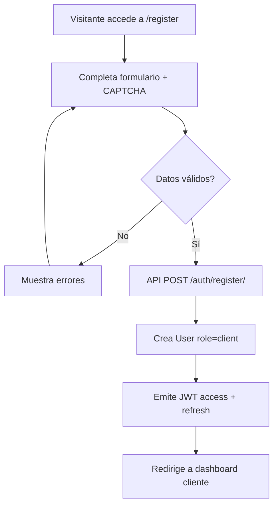
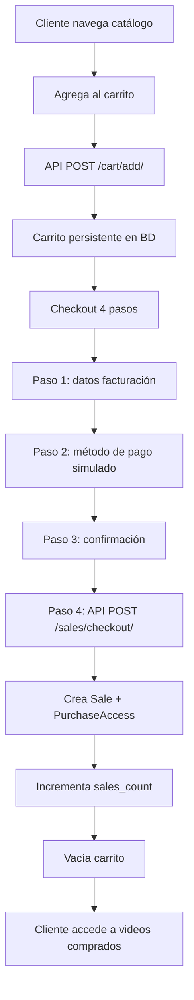
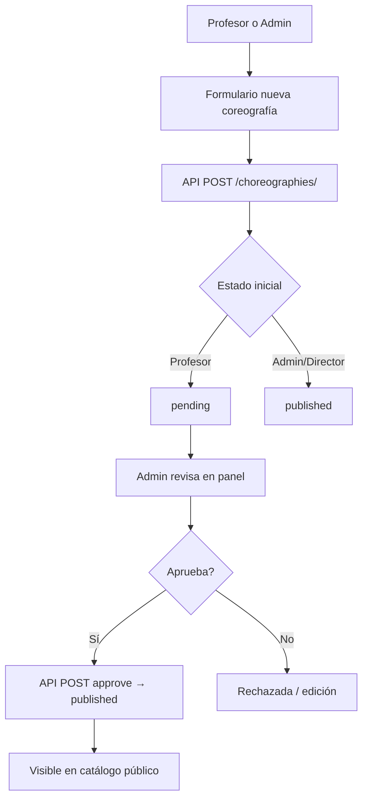
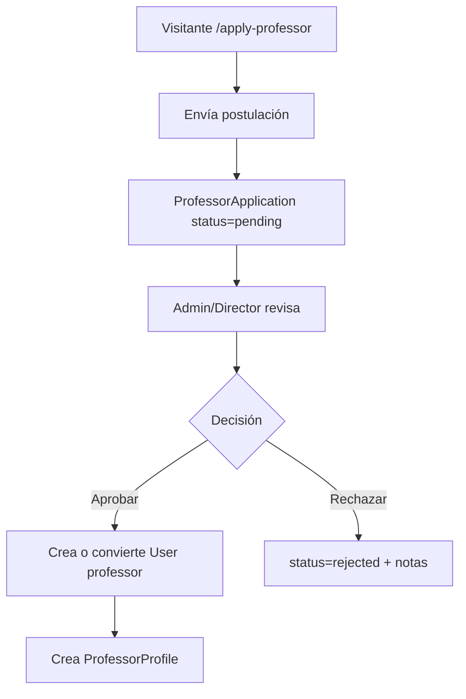
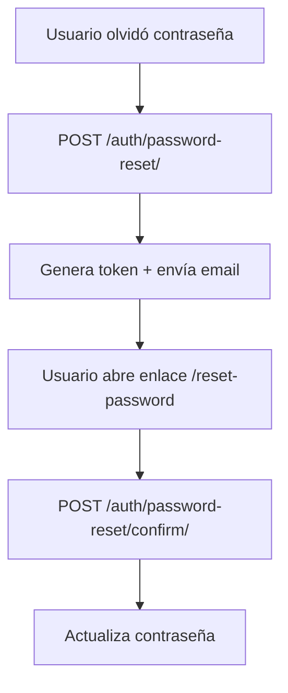
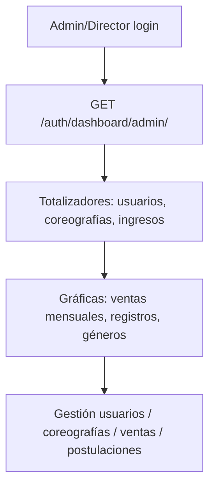

# BPMs del proyecto RITMOFLOW

Documento de Business Process Models (BPMs).

## 1. Registro y autenticación de clientes

## 2. Compra de coreografías (checkout)

## 3. Gestión de coreografías (profesor / admin)

## 4. Postulación y aprobación de profesores

## 5. Recuperación de contraseña

## 6. Dashboard administrador

## Referencia de actores

| Actor         | Rol en sistema | Procesos principales                       |
| ------------- | -------------- | ------------------------------------------ |
| Visitante     | Sin sesión     | Registro, catálogo, postulación profesor   |
| Cliente       | `client`       | Compra, carrito, checkout, ver videos      |
| Profesor      | `professor`    | CRUD coreografías, dashboard métricas      |
| Director      | `director`     | Aprobaciones, usuarios, ventas             |
| Administrador | `admin`        | Mismo alcance que director + configuración |

