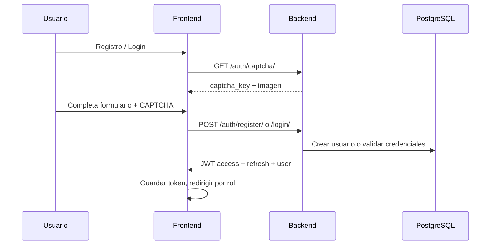
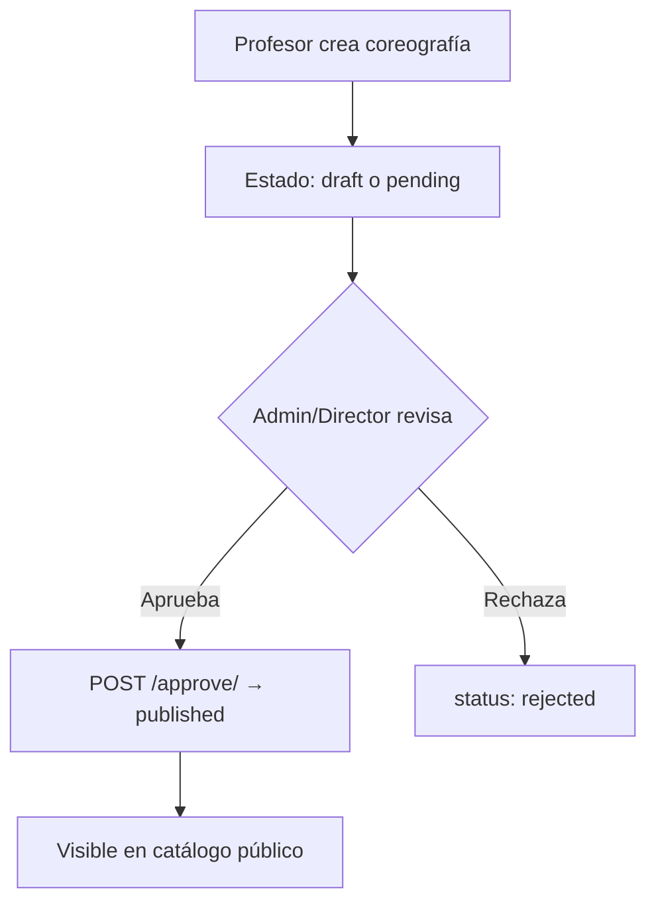
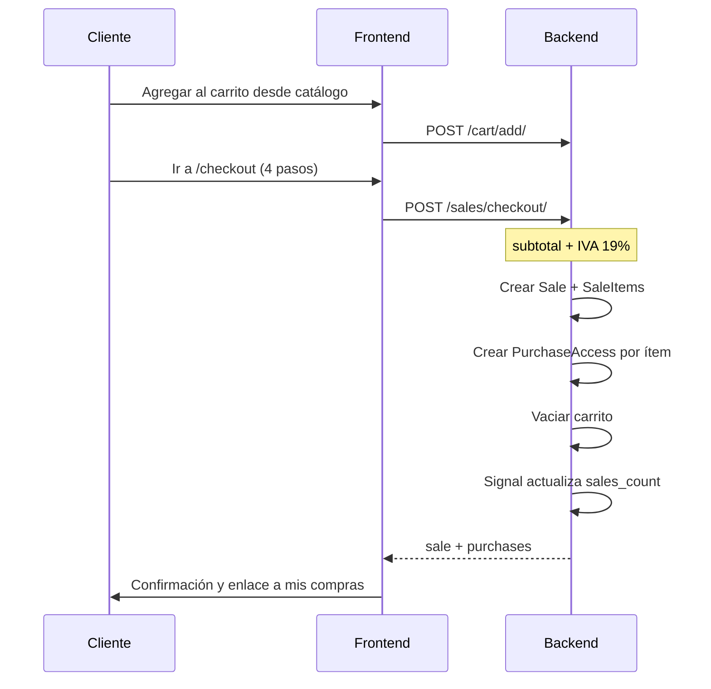

# Flujos de negocio

## 1. Registro e inicio de sesión

**Registro:** solo crea usuarios con rol `client`.  
**Login:** cualquier rol; redirección según `getAccountPath`.

---

## 2. Creación y publicación de coreografía

1. Profesor (o admin) crea coreografía con 3–4 videos en `ChoreographyFormPage`
2. La coreografía queda en estado pendiente o borrador
3. Admin/Director la aprueba desde `AdminChoreographiesPage`
4. Al publicarse, aparece en `/catalog`, `featured` y `hot_sales`

---

## 3. Compra de coreografía (checkout)

**IVA:** 19% sobre subtotal del carrito.  
**Pago:** simulado (card/PSE); la venta se marca `completed` de inmediato.

---

## 4. Consumo de contenido comprado

1. Cliente entra a `/dashboard` → ve compras con progreso
2. Clic en coreografía → `/my-choreographies/:purchaseId`
3. `PurchaseViewPage` carga `GET /sales/purchases/{id}/` con videos
4. Al reproducir una parte, `POST .../watch/` con `part_number`
5. `videos_watched` y `progress_percent` se actualizan

---

## 5. Recuperación de contraseña

1. Usuario en `/forgot-password` envía email
2. Backend genera `uid` + `token` (Django `default_token_generator`)
3. Envía correo con enlace `{FRONTEND_URL}/reset-password?uid=...&token=...`
4. En desarrollo el correo aparece en consola del servidor Django
5. Usuario define nueva contraseña en `/reset-password`
6. `POST /auth/password-reset/confirm/` valida token y actualiza clave

---

## 6. Gestión de usuarios internos

1. Admin/Director accede a `/admin/users`
2. Puede crear usuarios con rol admin, director o professor
3. Edición vía `PATCH /auth/internal/{id}/` (`InternalUserUpdateSerializer`)
4. Los clientes **no** se gestionan aquí; se registran por `/register`

---

## 7. Dashboard administrativo

`GET /auth/dashboard/admin/` agrega:

- Usuarios activos, coreografías publicadas
- Ingresos totales, número de ventas, ticket promedio
- Series de los últimos 6 meses: ventas e inscripciones
- Top coreografías por ventas
- Distribución por género musical

El frontend renderiza estas métricas con **Recharts** en `AdminDashboardPage`.

---

## 8. Contador de ventas (`sales_count`)

Automático vía Django Signals (`sales/signals.py`):

- Al crear/eliminar `SaleItem` de venta completada → recalcula
- Al cambiar estado de `Sale` → sincroniza contadores

No se incrementa manualmente en checkout. El campo es `editable=False` en el modelo.
